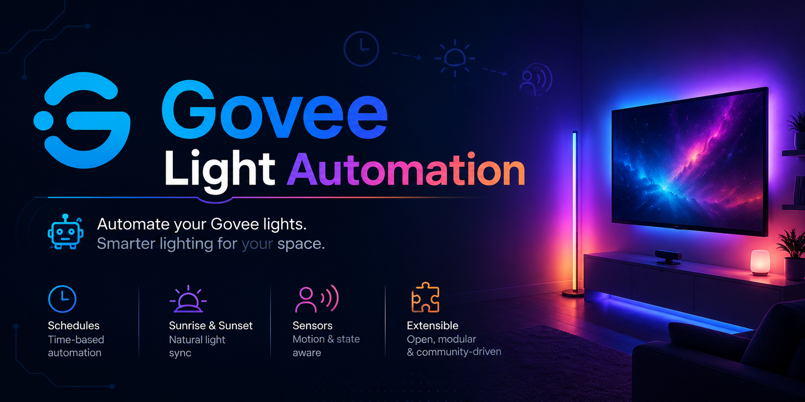

<p align="center">
  
</p>

# govee-automation

A local smart-home HUD for Govee lights.
The FastAPI backend proxies the Govee cloud API with rate-limit protection and API-key auth. The Next.js frontend renders per-device control cards with real-time state, scenes, and color controls.

---

## Stack

| Layer    | Tech                                              |
| -------- | ------------------------------------------------- |
| Backend  | Python 3.14 · FastAPI · httpx · pydantic-settings |
| Frontend | Next.js 16 · React 19 · TypeScript · Tailwind v4  |
| Runner   | uvicorn (local + Docker)                          |

---

## Features

**Dashboard**
- Per-device cards grouped by room (Living room → Kitchen → Office → Hallway)
- Toggle, brightness slider (debounced 300ms), offline badge
- **White tab** — color temperature slider with Candle / Warm / Neutral / Cool presets
- **Color tab** — native color picker + curated 20-swatch palette with rollback on failure
- **Vibe tab** — random neon color from a 10-color palette
- **Scenes** — Focus · Relax · Movie · Night · Party · Off (per-device or global)
- **Master bar** — All On / All Off + manual refresh
- Optimistic state updates with automatic rollback on API error
- State persisted to `localStorage` so UI survives refresh without re-polling

**Backend**
- Shared `asyncio.Semaphore(1)` serializes Govee cloud writes (10 req/min limit)
- Device list cached at startup and refreshed on demand (`/lights/states` avoids redundant list calls)
- `x-api-key` auth on protected routes
- Request ID middleware + structured logging
- `/health` endpoint with uptime and device count

---

## Setup

### Environment variables

**Backend** (`.env` in project root)

```env
GOVEE_API_KEY=your_govee_api_key
GOVEE_SERVER_KEY=a_secret_key_you_choose
```

**Frontend** (`.env` in `frontend/`)

```env
NEXT_PUBLIC_GOVEE_SERVER_KEY=same_secret_key_as_above
NEXT_PUBLIC_GOVEE_API_URL=http://localhost:8000   # set to http://devforge.local:8000 for mobile
```

Get your Govee API key at [developer.govee.com](https://developer.govee.com).

### Run mode A: local development

**Backend**
```bash
uv sync
uvicorn app.main:app --reload
# http://localhost:8000
```

**Frontend**
```bash
cd frontend
npm install
npm run dev
# http://localhost:3000
```

### Run mode B: Docker (backend only)

```bash
docker build -t govee-api .
docker run -p 8080:8080 --env-file .env govee-api
```

Note: `pip install -r requirements.txt` in the Dockerfile runs during image build (inside Docker), not in your host shell.

---

## Project structure

```
govee-automation/
├── app/
│   ├── main.py           # FastAPI app, lifespan, middleware wiring
│   ├── config.py         # pydantic-settings (GOVEE_API_KEY, GOVEE_SERVER_KEY)
│   ├── dependencies.py   # x-api-key auth
│   ├── middleware.py     # request ID injection + logging
│   ├── exceptions.py     # httpx error handlers
│   ├── logger.py
│   └── routers/
│       └── lights.py     # GET /lights/, GET /lights/states, PUT /lights/{id}/control
├── frontend/
│   └── src/app/
│       └── dashboard/
│           └── page.tsx  # main HUD: device cards, scene bar, master bar
├── Dockerfile
└── pyproject.toml
```

---

## API

| Method | Path                          | Description                      |
| ------ | ----------------------------- | -------------------------------- |
| GET    | `/`                           | Health ping                      |
| GET    | `/health`                     | Uptime + device count            |
| GET    | `/lights/`                    | List all registered devices      |
| GET    | `/lights/states`              | Real-time state for all devices  |
| PUT    | `/lights/{device_id}/control` | Send a command to a single light |

All routes except `/` and `/health` require the `x-api-key` header.
